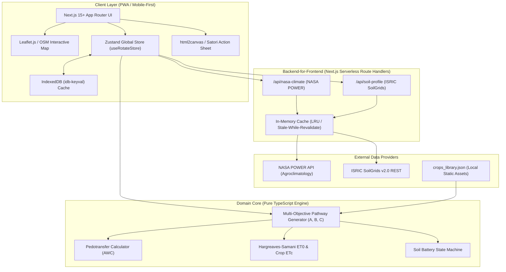

# Technical Implementation Plan: TerraRotate (TerraShaft) Engine
**Adaptive Crop Rotation & Soil Regeneration Progressive Web Application**

---

## 1. Executive Summary & Scope Alignment

Dokumen ini merupakan panduan implementasi rekayasa perangkat lunak (*software engineering implementation plan*) untuk **TerraRotate** (disebut juga sebagai *TerraShaft*), sebuah sistem rekomendasi rotasi tanaman multi-musim adaptif berbasis data biofisik satelit (NASA POWER, SMAP) dan profil tanah spasial (ISRIC SoilGrids).

### 1.1 Core Objectives
1. **Kalkulasi Jendela Tanam Presisi:** Menggantikan kalender tanam statis dengan evaluasi neraca air zona perakaran (*root-zone soil moisture deficit*) harian.
2. **Model "Soil Battery":** Visualisasi interaktif status hara tanah (Karbon Organik, Nitrogen, Kelembapan) layaknya baterai yang terisi (*charging*) oleh legum/cover crop dan terdischarges (*draining*) oleh sereal monokultur rakus hara.
3. **Penyusunan 3 Skenario Rotasi Optimal:**
   - **Pathway A:** *Max Soil Regeneration* (pemulihan bahan organik tanah).
   - **Pathway B:** *Drought Resilience* (ketahanan terhadap ancaman kekeringan/kemarau ekstrem).
   - **Pathway C:** *Cash-Flow Optimized* (keuntungan ekonomi maksimal dalam batas toleransi air tanah).
4. **Distribusi Lapangan Berkecepatan Tinggi:** *Action Sheet* (1080×1350 px, rasio 4:5) yang di-generate instan untuk disebar via WhatsApp ke petani dan Penyuluh Pertanian Lapangan (PPL).

---

## 2. System Architecture & Tech Stack



### 2.2 Tech Stack Selection & Justification

| Layer | Pilihan Teknologi | Alasan Pemilihan & Keunggulan |
|---|---|---|
| **Framework** | Next.js 15+ (App Router, React 19, TypeScript) | Performa SSR/SSG, route handler terintegrasi sebagai proxy aman, arsitektur modular. |
| **Styling** | Tailwind CSS + Radix UI / Shadcn UI | Desain modern, ultra-ringan, ramah sentuhan layar ponsel (mobile-first), dark/light mode mudah. |
| **Peta Interaktif** | Mapbox GL JS (Satellite Basemap) | Visualisasi citra satelit fotorealistik resolusi tinggi, memberikan kesan premium (*wow effect*) untuk PPL & juri kompetisi. |
| **State & Offline** | Zustand + `idb-keyval` + Workbox PWA | State management minimalis tanpa boilerplate, persisten di IndexedDB, mendukung penambahan tanaman kustom lokal. |
| **Visualisasi Data** | Recharts (Radar Chart & Timeline) + Custom SVG Gauge | Visualisasi interaktif trade-off agronomi & animasi baterai tanah 60 FPS. |
| **Export Engine** | `html-to-image` / Canvas API | Render visual kartu WhatsApp 1080×1350 px langsung di peramban klien tanpa beban server. |

---

## 3. Data Pipeline & Formula Spesifikasi Agronomi

### 3.1 Integrasi API & Caching
1. **NASA POWER API (`/api/nasa-climate`)**:
   - Parameter: `T2M_MIN`, `T2M_MAX`, `PRECTOTCORR`, `ALLSKY_SFC_SW_DWN`, `GWETROOT` (root-zone soil wetness proxy untuk SMAP).
   - Cache Strategy: Koordinat dibulatkan ke 2 desimal (~1.1 km); Cache TTL = 24 jam (karena data agro-klimatologis diperbarui harian).
2. **ISRIC SoilGrids v2.0 (`/api/soil-profile`)**:
   - Parameter: `clay`, `sand`, `silt`, `soc`, `phh2o`, `cec` pada kedalaman `0-30cm`.
   - Konversi Satuan:
     - Tekstur (Clay/Sand/Silt): $g/kg \div 10 = \%$
     - SOC (Soil Organic Carbon): $dg/kg \div 100 = \%$
     - pH: nilai $pH \times 10 \div 10$
   - Cache Strategy: Cache TTL = 30 hari (karakteristik profil tanah statis).

### 3.2 Rumus Perhitungan Utama

1. **Available Water Capacity ($AWC$):**
   $$AWC = 0.15 \cdot \text{Sand}\% + 0.35 \cdot \text{Silt}\% + 0.40 \cdot \text{Clay}\% + (1.2 \cdot \text{SOC}\%)$$

2. **Evapotranspirasi Potensial ($ET_0$ Hargreaves-Samani):**
   $$ET_0 = 0.0023 \cdot R_a \cdot (T_{mean} + 17.8) \cdot \sqrt{T_{max} - T_{min}}$$
   *Kebutuhan Air Tanaman:* $ET_c = ET_0 \cdot K_c$

3. **Defisit Air Musiman ($W_{deficit}$):**
   $$W_{deficit} = \max(0, ET_c - (\text{Rainfall}_{\text{musim}} + AWC))$$
   *(Jika $W_{deficit} > 100\text{ mm}$, tandai peringatan risiko kekeringan pada UI).*

4. **Soil Battery Formula ($B$):**
   $$B_{initial} = \min(100, \max(10, 40 + (20 \cdot \text{SOC}\%)))$$
   - Musim dengan `Legume` atau `Cover Crop`: $B_{t+1} = \min(100, B_t + 15\%)$
   - Musim dengan `Cereal` beruntun tanpa jeda: $B_{t+1} = \max(0, B_t - 20\%)$
   - Musim dengan tanaman toleran / bera hijau: $B_{t+1} = B_t$

5. **Composite Score Multi-Objektif:**
   $$S = (w_{profit} \cdot P) + (w_{water} \cdot (100 - \frac{W_{deficit}}{2})) + (w_{soil} \cdot B_{final})$$

---

## 4. Implementation Roadmap (4 Sprint / 7-10 Hari)

### Sprint 1: Data Plumbing & Proxy Layer (Hari 1–2)
* [ ] Setup repositori Next.js 15 (TypeScript, Tailwind, Radix UI, Zustand, Lucide).
* [ ] Buat file referensi tanaman `src/data/crops_library.json` (6 komoditas awal + varietas lokal Nusa Tenggara/Jawa).
* [ ] Bangun Route Handler `/api/nasa-climate` dengan fallback mock data saat offline/timeout.
* [ ] Bangun Route Handler `/api/soil-profile` dengan konversi unit & rumus AWC pedotransfer.
* [ ] Implementasi In-Memory Caching untuk koordinat berdekatan.

### Sprint 2: Core Optimization Engine & Agronomy Logic (Hari 3–4)
* [ ] Buat modul `src/lib/pedotransfer.ts` (kalkulasi AWC, porositas tanah, tekstur USDA).
* [ ] Buat modul `src/lib/optimizationEngine.ts`:
  * Generator kombinasi 4 musim ($4^6 = 1296$ permutasi dievaluasi).
  * Filter kekeringan: eliminasi kombinasi tanaman boros air di musim kering (Jul–Okt).
  * Logika Pathway A (*Max Soil*), Pathway B (*Drought Resilience*), dan Pathway C (*Cash Flow*).
* [ ] Unit test perhitungan Soil Battery & neraca nitrogen kumulatif ($\Delta N$).

### Sprint 3: Interactive UI, Map & Visual Components (Hari 5–6)
* [ ] Komponen Peta Interaktif `src/components/map/LocationSelector.tsx` (Leaflet OSM, pin drag-drop, reverse geocoding desa/kecamatan).
* [ ] Komponen Indikator `SoilBatteryGauge.tsx` (animasi tabung baterai dinamis, persentase + badge "Charging/Draining").
* [ ] Komponen `RotationTimeline.tsx` (Gantt-style 4 musim dengan status air, N-balance, dan profit).
* [ ] Komponen `RadarComparison.tsx` (Recharts Spider Chart membandingkan 3 Pathway).
* [ ] Kontrol slider prioritas petani (*Profit*, *Hemat Air*, *Tanah Sehat*) dengan 3 tombol preset cepat.

### Sprint 4: Action Sheet Export, PWA & Field Polishing (Hari 7–8)
* [ ] Komponen Modal `ActionSheetModal.tsx`:
  * Render template kartu WhatsApp 1080×1350 px (4:5).
  * Tombol unduh PNG langsung dan trigger `navigator.share()` untuk kirim ke grup WhatsApp petani.
* [ ] PWA Service Worker configuration (Workbox / `next-pwa`) untuk caching offline halaman dashboard.
* [ ] Uji coba simulasi end-to-end pada titik koordinat lahan kering (misal: Kupang Timur, NTT `-10.1542, 123.8210` dan Gunungkidul, DIY `-7.9656, 110.6012`).

---

## 5. Potential Bottlenecks & Mitigation Strategies

| Risiko / Bottleneck | Dampak | Strategi Mitigasi |
|---|---|---|
| **Latensi API NASA POWER (1.5 - 3 detik)** | Pengguna merasa aplikasi lambat saat memindahkan pin peta. | Gunakan *Stale-While-Revalidate* cache; tampilkan skeleton loader instan dengan data historis default regional. |
| **Resolusi Spasial NASA POWER (~50 km)** | Variasi iklim mikro pegunungan tidak terdeteksi presisi. | Sediakan toggle "Koreksi Iklim Lokal" (petani/penyuluh bisa menyesuaikan curah hujan aktual jika ada data pos hujan). |
| **Koneksi Lemah di Area Pelosok Sawah** | Aplikasi gagal memuat tile peta OSM. | Simpan tile area terdekat di IndexedDB, izinkan input manual koordinat atau pilih daftar Kabupaten/Kecamatan offline. |
| **Generasi Gambar WhatsApp di Ponsel Low-End** | Browser crash saat render canvas resolusi tinggi. | Render menggunakan CSS-to-Canvas teroptimasi pada skala 1x lalu export ke blob, atau siapkan fallback PDF vektor ringan. |

---

## 6. Project Directory Blueprint

```text
terrarotate-app/
├── public/
│   ├── manifest.json
│   └── icons/
├── src/
│   ├── app/
│   │   ├── api/
│   │   │   ├── nasa-climate/route.ts
│   │   │   └── soil-profile/route.ts
│   │   ├── layout.tsx
│   │   └── page.tsx
│   ├── components/
│   │   ├── map/LocationMap.tsx
│   │   ├── dashboard/BioPhysicalCard.tsx
│   │   ├── dashboard/SoilBattery.tsx
│   │   ├── dashboard/PrioritySliders.tsx
│   │   ├── dashboard/RotationTimeline.tsx
│   │   ├── dashboard/RadarComparison.tsx
│   │   └── export/WhatsAppCardModal.tsx
│   ├── data/
│   │   └── crops_library.json
│   ├── lib/
│   │   ├── pedotransfer.ts
│   │   ├── evapotranspiration.ts
│   │   ├── optimizationEngine.ts
│   │   └── exportCardGenerator.ts
│   ├── store/
│   │   └── useRotateStore.ts
│   └── types/
│       ├── agronomy.ts
│       └── climate.ts
├── tailwind.config.ts
├── package.json
└── tsconfig.json
```
